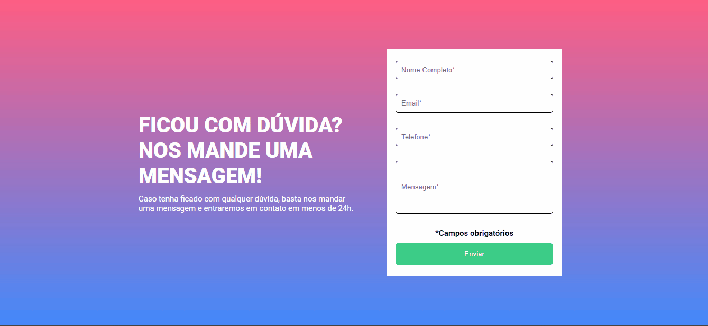

# 🖥️ Tela de "Envie sua dúvida"  

## 📜 Descrição
Projeto realizado com o objetivo de criar uma tela, onde a pessoa possa mandar alguma dúvida. Foi feita com as skills abaixo para treinamento de como fazer validações de fomulários. Foi usado como inspiração um layout do figma.

## ✍️ Processo
- Marcação semântica HTML5
- Propriedades personalizadas de CSS3
- JavaScript
- Flexbox  
- Design responsivo
- Validação de Formulários

### ⌨ Funcionalidades

A validação vai mostrar uma mensagem de erro em cada input vazio, ficando com a borda vermelha e quando estiver tudo correto, ficará com a borda verde.
    
## 🖱️ A página
    

> <a href="https://devkarine.github.io/tela-envie-sua-duvida/" target= "_blank">Acesse a página online</a>  

## 👩‍💻 Dev
<table align="center">
  <tr>
    <td align="center">
      

         
          <b> Karine Pereira </b> 
            
            
      

    </td>

  </tr>
</table>
